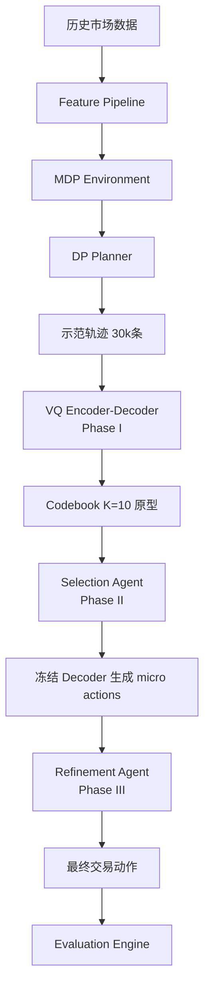
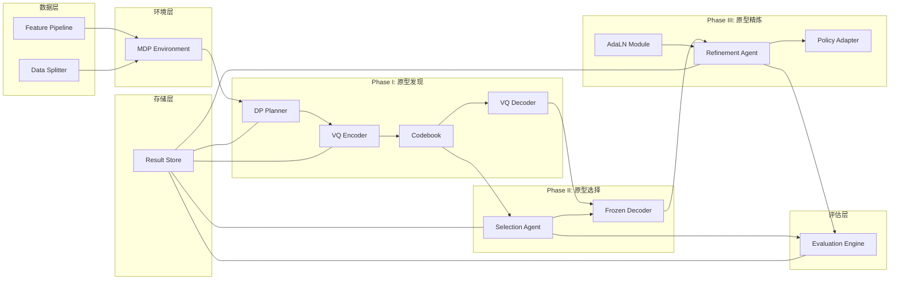
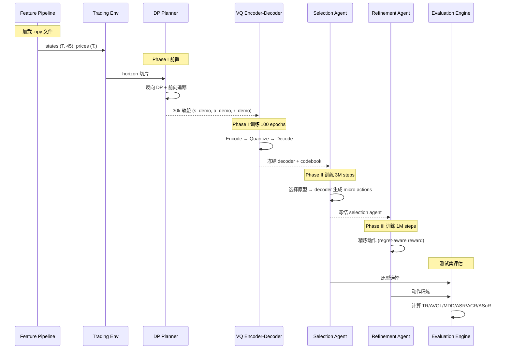

# 技术设计文档：ArchetypeTrader

## 概述

ArchetypeTrader 是一个基于 PyTorch 的三阶段强化学习量化交易框架，实现 AAAI26 论文中描述的原型交易方法。系统处理 10 分钟级别加密货币数据（含 25 级限价订单簿），通过以下三个阶段实现交易策略：

1. **Phase I — 原型发现**：使用动态规划（DP）在历史数据上生成最优示范轨迹，然后通过 VQ 编码器-解码器将轨迹压缩为 K=10 个离散交易原型
2. **Phase II — 原型选择**：训练 horizon 级别 RL agent，在每个交易周期开始时选择最合适的原型，冻结 decoder 生成 micro actions
3. **Phase III — 原型精炼**：训练 step 级别 RL agent，使用 regret-aware reward 对原型动作进行微调，每个 horizon 最多一次调整

系统支持 BTC/ETH/DOT/BNB vs USDT 四个交易对，使用 36 维单步特征 + 9 维趋势特征作为状态输入。



## 架构

### 高层架构

系统采用分层模块化架构，各阶段独立训练，通过 `result/` 目录传递中间产物。



### 目录结构

```
archetype-trader/
├── data/
│   └── feature_list/
│       ├── single_features.npy      # 36维单步特征
│       └── trend_features.npy       # 9维趋势特征
├── src/
│   ├── __init__.py
│   ├── config.py                    # 全局配置与超参数
│   ├── data/
│   │   ├── __init__.py
│   │   ├── feature_pipeline.py      # 特征加载与处理
│   │   └── dataset.py               # PyTorch Dataset 封装
│   ├── env/
│   │   ├── __init__.py
│   │   └── trading_env.py           # MDP 交易环境
│   ├── phase1/
│   │   ├── __init__.py
│   │   ├── dp_planner.py            # 动态规划示范轨迹生成
│   │   ├── vq_encoder.py            # LSTM VQ 编码器
│   │   ├── vq_decoder.py            # VQ 解码器
│   │   └── codebook.py              # 向量量化码本
│   ├── phase2/
│   │   ├── __init__.py
│   │   └── selection_agent.py       # 原型选择 RL Agent
│   ├── phase3/
│   │   ├── __init__.py
│   │   ├── refinement_agent.py      # 原型精炼 RL Agent
│   │   ├── policy_adapter.py        # 策略适配器
│   │   └── adaln.py                 # Adaptive Layer Normalization
│   ├── evaluation/
│   │   ├── __init__.py
│   │   └── metrics.py               # 评估指标计算
│   └── utils/
│       ├── __init__.py
│       └── logger.py                # 日志工具
├── scripts/
│   ├── train_phase1.py              # Phase I 训练脚本
│   ├── train_phase2.py              # Phase II 训练脚本
│   ├── train_phase3.py              # Phase III 训练脚本
│   └── evaluate.py                  # 评估脚本
├── result/                          # 中间产物与模型存储
│   ├── dp_trajectories/
│   ├── phase1_archetype_discovery/
│   ├── phase2_archetype_selection/
│   ├── phase3_archetype_refinement/
│   └── evaluation/
└── tests/
    ├── __init__.py
    ├── test_feature_pipeline.py
    ├── test_trading_env.py
    ├── test_dp_planner.py
    ├── test_vq.py
    ├── test_selection_agent.py
    ├── test_refinement_agent.py
    └── test_metrics.py
```


## 组件与接口

### 1. Feature Pipeline (`src/data/feature_pipeline.py`)

负责加载、验证和组织市场特征数据。

```python
class FeaturePipeline:
    """特征加载与处理管道"""
    
    def __init__(self, data_dir: str, pair: str):
        """
        Args:
            data_dir: 数据根目录路径
            pair: 交易对名称，如 'BTC', 'ETH', 'DOT', 'BNB'
        """
    
    def load_single_features(self) -> np.ndarray:
        """加载 36 维单步特征，返回 shape (T, 36)"""
    
    def load_trend_features(self) -> np.ndarray:
        """加载 9 维趋势特征，返回 shape (T, 9)"""
    
    def get_state_vector(self) -> np.ndarray:
        """拼接单步和趋势特征，返回 shape (T, 45)"""
    
    def split_by_date(self) -> Tuple[np.ndarray, np.ndarray, np.ndarray]:
        """按时间范围划分训练/验证/测试集"""
    
    def split_into_horizons(self, data: np.ndarray, h: int = 72) -> List[np.ndarray]:
        """按 horizon 长度切分数据"""
```

### 2. MDP Trading Environment (`src/env/trading_env.py`)

符合论文定义的交易环境，支持 DP 规划和 RL 训练。

```python
class TradingEnv:
    """MDP 交易环境
    
    # 论文 Section 3.1: MDP 定义
    # 状态空间: LOB 数据 + OHLCV + 技术指标
    # 动作空间: a_t ∈ {0, 1, 2} → short/flat/long
    # 持仓: P_t ∈ {-m, 0, m}
    """
    
    POSITION_MAP = {0: -1, 1: 0, 2: 1}  # action → position direction
    MAX_POSITIONS = {'BTC': 8, 'ETH': 100, 'DOT': 2500, 'BNB': 200}
    COMMISSION_RATE = 0.0002  # δ = 0.02%
    
    def __init__(self, states: np.ndarray, prices: np.ndarray, pair: str, horizon: int = 72):
        """
        Args:
            states: 状态序列 shape (T, state_dim)
            prices: 价格序列 shape (T,)，用于奖励计算
            pair: 交易对名称
            horizon: 交易周期长度
        """
    
    def reset(self, horizon_idx: int) -> np.ndarray:
        """重置环境到指定 horizon 的起始状态"""
    
    def step(self, action: int) -> Tuple[np.ndarray, float, bool, dict]:
        """
        执行一步交易动作
        
        # 论文 Eq. 1: r_step_t = P_t × (p_mark_{t+1} - p_mark_t) - O_t
        
        Returns:
            next_state, reward, done, info
        """
    
    def compute_fill_cost(self, action: int, current_position: int) -> float:
        """
        # 论文 Section 3.1: LOB fill cost 计算
        根据 LOB 深度计算实际成交价格与中间价的差异
        """
    
    def compute_execution_cost(self, action: int, current_position: int, price: float) -> float:
        """计算总执行损失 = fill cost + 佣金"""
```

### 3. DP Planner (`src/phase1/dp_planner.py`)

实现论文 Algorithm 1 的单次交易约束动态规划。

```python
class DPPlanner:
    """
    # 论文 Algorithm 1: Single-trade DP planner
    # 输入: 价格序列 P (长度 N), 动作集 A
    # 状态: V[N+1, |A|, 2], Π[N, |A|, 2]
    # 约束: 每个 horizon 内最多一次交易 (c ∈ {0, 1})
    """
    
    def __init__(self, env: TradingEnv):
        """
        Args:
            env: MDP 交易环境实例
        """
    
    def plan(self, states: np.ndarray, prices: np.ndarray) -> Tuple[np.ndarray, np.ndarray, np.ndarray]:
        """
        对单个 horizon 执行动态规划
        
        # Algorithm 1, Step 1: 初始化 V[N, a, c] = 0
        # Algorithm 1, Step 2: 从 t=N-1 反向到 0
        # Algorithm 1, Step 3: 前向追踪生成最优动作序列
        
        Returns:
            s_demo: 状态序列 (h, state_dim)
            a_demo: 动作序列 (h,)
            r_demo: 奖励序列 (h,)
        """
    
    def generate_trajectories(self, num_trajectories: int = 30000) -> Dict[str, np.ndarray]:
        """
        生成指定数量的示范轨迹
        
        Returns:
            {'states': (N, h, state_dim), 'actions': (N, h), 'rewards': (N, h)}
        """
```

### 4. VQ Encoder (`src/phase1/vq_encoder.py`)

```python
class VQEncoder(nn.Module):
    """
    # 论文 Section 4.1: LSTM-based encoder
    # q_θe(z_e | s_demo, a_demo, r_demo)
    # 隐藏层 128, 输出 z_e 维度 16
    """
    
    def __init__(self, state_dim: int, action_dim: int = 3, hidden_dim: int = 128, latent_dim: int = 16):
        """
        Args:
            state_dim: 状态向量维度 (45)
            action_dim: 动作空间大小 (3)
            hidden_dim: LSTM 隐藏层维度 (128)
            latent_dim: 潜在嵌入维度 (16)
        """
    
    def forward(self, s_demo: Tensor, a_demo: Tensor, r_demo: Tensor) -> Tensor:
        """
        编码示范轨迹为连续嵌入
        
        Args:
            s_demo: (batch, h, state_dim)
            a_demo: (batch, h)
            r_demo: (batch, h)
        
        Returns:
            z_e: (batch, latent_dim)
        """
```

### 5. Codebook (`src/phase1/codebook.py`)

```python
class VQCodebook(nn.Module):
    """
    # 论文 Section 4.1: 可学习码本
    # ε = {e_0, ..., e_{K-1}}, K=10, 维度 16
    # 量化: k = argmin_j ||z_e - e_j||², z_q = e_k
    """
    
    def __init__(self, num_codes: int = 10, code_dim: int = 16):
        """
        Args:
            num_codes: 原型数量 K (10)
            code_dim: 码本向量维度 (16)
        """
    
    def quantize(self, z_e: Tensor) -> Tuple[Tensor, Tensor, Tensor]:
        """
        向量量化
        
        Returns:
            z_q: 量化后的嵌入 (batch, code_dim)
            indices: 选中的码本索引 (batch,)
            commitment_loss: 承诺损失
        """
```

### 6. VQ Decoder (`src/phase1/vq_decoder.py`)

```python
class VQDecoder(nn.Module):
    """
    # 论文 Section 4.1: Decoder
    # p_θd(â_demo | s_demo, z_q)
    # 根据状态和量化嵌入重建动作序列
    """
    
    def __init__(self, state_dim: int, code_dim: int = 16, hidden_dim: int = 128, action_dim: int = 3):
        """
        Args:
            state_dim: 状态向量维度
            code_dim: 码本向量维度
            hidden_dim: 隐藏层维度
            action_dim: 动作空间大小
        """
    
    def forward(self, states: Tensor, z_q: Tensor) -> Tensor:
        """
        根据状态和量化嵌入生成动作序列
        
        Args:
            states: (batch, h, state_dim)
            z_q: (batch, code_dim)
        
        Returns:
            action_logits: (batch, h, action_dim)
        """
```

### 7. Selection Agent (`src/phase2/selection_agent.py`)

```python
class SelectionAgent(nn.Module):
    """
    # 论文 Section 4.2: Horizon-level RL agent
    # M_sel = ⟨S_sel, A_sel, R_sel, γ⟩
    # 在每个 horizon 开始时选择原型索引 a_sel ∈ {0, ..., K-1}
    """
    
    def __init__(self, state_dim: int, num_archetypes: int = 10):
        """
        Args:
            state_dim: 状态向量维度
            num_archetypes: 原型数量 K
        """
    
    def forward(self, state: Tensor) -> Tuple[Tensor, Tensor]:
        """
        根据当前状态输出原型选择的策略分布
        
        Args:
            state: (batch, state_dim) — horizon 第一个 bar 的状态
        
        Returns:
            action_probs: (batch, K) 原型选择概率
            value: (batch, 1) 状态价值估计
        """
    
    def select_archetype(self, state: Tensor) -> int:
        """推理时选择原型索引"""
```

### 8. Refinement Agent (`src/phase3/refinement_agent.py`)

```python
class RefinementAgent(nn.Module):
    """
    # 论文 Section 4.3: Step-level policy adapter
    # M_ref = {S_ref, A_ref, R_ref}
    # s_ref = [s_ref1, s_ref2]
    # s_ref1 = 市场观测, s_ref2 = [e_a_sel, a_base, R_arche, τ_remain]
    # a_ref ∈ {-1, 0, 1}
    """
    
    def __init__(self, market_dim: int, context_dim: int):
        """
        Args:
            market_dim: 市场观测维度 (s_ref1)
            context_dim: 上下文维度 (s_ref2 = code_dim + 1 + 1 + 1)
        """
    
    def forward(self, s_ref1: Tensor, s_ref2: Tensor) -> Tuple[Tensor, Tensor]:
        """
        输出调整信号的策略分布
        
        Args:
            s_ref1: (batch, market_dim) 市场观测
            s_ref2: (batch, context_dim) 上下文 [e_a_sel, a_base, R_arche, τ_remain]
        
        Returns:
            action_probs: (batch, 3) 调整信号概率 {-1, 0, 1}
            value: (batch, 1) 状态价值估计
        """
```

### 9. Policy Adapter (`src/phase3/policy_adapter.py`)

```python
class PolicyAdapter:
    """
    # 论文 Eq. 6: 最终动作计算
    # a_final = a_base  if a_base ≠ a_base_{t-1} or a_ref = 0
    # a_final = 0       if a_ref = -1
    # a_final = 2       if a_ref = 1
    # 约束: 每个 horizon 最多一次调整
    """
    
    def __init__(self):
        self.adjusted_in_horizon: bool = False
    
    def compute_final_action(self, a_base: int, a_base_prev: int, a_ref: int) -> int:
        """
        根据 Eq. 6 计算最终动作
        
        Args:
            a_base: 当前 decoder 输出的基础动作
            a_base_prev: 上一步的基础动作
            a_ref: refinement agent 的调整信号
        
        Returns:
            a_final: 最终交易动作
        """
    
    def reset(self):
        """在新 horizon 开始时重置调整状态"""
```

### 10. AdaLN Module (`src/phase3/adaln.py`)

```python
class AdaptiveLayerNorm(nn.Module):
    """
    # 论文 Section 4.3: Adaptive Layer Normalization
    # 用 s_ref2 条件化 s_ref1 的处理
    # AdaLN(x, c) = γ(c) * LayerNorm(x) + β(c)
    """
    
    def __init__(self, feature_dim: int, condition_dim: int):
        """
        Args:
            feature_dim: 被条件化的特征维度
            condition_dim: 条件向量维度 (s_ref2)
        """
    
    def forward(self, x: Tensor, condition: Tensor) -> Tensor:
        """
        Args:
            x: (batch, feature_dim) 市场观测特征
            condition: (batch, condition_dim) 条件向量
        
        Returns:
            (batch, feature_dim) 条件化后的特征
        """
```

### 11. Evaluation Engine (`src/evaluation/metrics.py`)

```python
class EvaluationEngine:
    """评估引擎，计算论文中定义的所有指标"""
    
    ANNUALIZATION_FACTOR = 52560  # 10分钟级别年化因子 m
    
    def compute_total_return(self, returns: np.ndarray) -> float:
        """TR = Π(1 + r_t) - 1"""
    
    def compute_annual_volatility(self, returns: np.ndarray) -> float:
        """AVOL = σ[r] × √m, m=52560"""
    
    def compute_max_drawdown(self, cumulative_returns: np.ndarray) -> float:
        """MDD = max(peak - trough) / peak"""
    
    def compute_annual_sharpe_ratio(self, returns: np.ndarray) -> float:
        """ASR = E[r] / σ[r] × √m"""
    
    def compute_annual_calmar_ratio(self, returns: np.ndarray) -> float:
        """ACR = E[r] / MDD × m"""
    
    def compute_annual_sortino_ratio(self, returns: np.ndarray) -> float:
        """ASoR = E[r] / DD × √m, DD = downside deviation"""
    
    def evaluate(self, returns: np.ndarray) -> Dict[str, float]:
        """计算所有指标并返回字典"""
```


## 数据模型

### 核心数据结构

#### 1. 市场状态向量

```
State Vector (45 维):
├── single_features (36 维):
│   ├── volume (1)
│   ├── bid/ask sizes normalized (10): bid1-5_size_n, ask1-5_size_n
│   ├── wap (3): wap_1, wap_2, wap_balance
│   ├── spreads (3): buy_spread, sell_spread, price_spread
│   ├── volumes (3): buy_volume, sell_volume, volume_imbalance
│   ├── vwap (2): sell_vwap, buy_vwap
│   ├── log returns (4): log_return_bid1/bid2/ask1/ask2_price
│   ├── log return wap (1): log_return_wap_1
│   └── K线形态 (9): kmid, klen, kmid2, kup, kup2, klow, klow2, ksft, ksft2
└── trend_features (9 维):
    └── 60期趋势: ask1/bid1_price, buy/sell_spread, wap_1/wap_2, buy/sell_vwap, volume
```

#### 2. DP 轨迹数据

```python
@dataclass
class DPTrajectory:
    states: np.ndarray    # (h, state_dim) — horizon 内的状态序列
    actions: np.ndarray   # (h,) — 最优动作序列, 值域 {0, 1, 2}
    rewards: np.ndarray   # (h,) — 逐步奖励
    pair: str             # 交易对名称
    horizon_idx: int      # horizon 索引
```

存储格式：`result/dp_trajectories/{pair}_trajectories.npz`

#### 3. VQ 模型产物

```python
@dataclass
class PhaseIArtifacts:
    encoder_state_dict: dict    # VQ Encoder 权重
    decoder_state_dict: dict    # VQ Decoder 权重
    codebook_vectors: np.ndarray  # (K, code_dim) = (10, 16) 码本向量
    training_loss_history: List[float]
```

存储格式：`result/phase1_archetype_discovery/{pair}_vq_model.pt`

#### 4. Selection Agent 模型产物

```python
@dataclass
class PhaseIIArtifacts:
    agent_state_dict: dict      # Selection Agent 权重
    training_rewards: List[float]
    best_validation_metric: float
```

存储格式：`result/phase2_archetype_selection/{pair}_selection_agent.pt`

#### 5. Refinement Agent 模型产物

```python
@dataclass
class PhaseIIIArtifacts:
    agent_state_dict: dict      # Refinement Agent 权重
    adaln_state_dict: dict      # AdaLN 权重
    beta1: float                # 使用的 β_1 值
    training_rewards: List[float]
```

存储格式：`result/phase3_archetype_refinement/{pair}_refinement_agent_beta{beta1}.pt`

#### 6. 评估结果

```python
@dataclass
class EvaluationResult:
    pair: str
    total_return: float         # TR
    annual_volatility: float    # AVOL
    max_drawdown: float         # MDD
    annual_sharpe_ratio: float  # ASR
    annual_calmar_ratio: float  # ACR
    annual_sortino_ratio: float # ASoR
    daily_returns: np.ndarray   # 逐步收益序列
```

存储格式：`result/evaluation/{pair}_results.json`

### 配置数据模型

```python
@dataclass
class Config:
    # 数据配置
    data_dir: str = "data/feature_list"
    result_dir: str = "result"
    pairs: List[str] = field(default_factory=lambda: ["BTC", "ETH", "DOT", "BNB"])
    
    # 特征维度
    single_feature_dim: int = 36
    trend_feature_dim: int = 9
    state_dim: int = 45  # single + trend
    
    # MDP 配置
    action_dim: int = 3           # {0: short, 1: flat, 2: long}
    horizon: int = 72             # h = 72 步
    commission_rate: float = 0.0002  # δ = 0.02%
    max_positions: Dict[str, int] = field(default_factory=lambda: {
        'BTC': 8, 'ETH': 100, 'DOT': 2500, 'BNB': 200
    })
    
    # Phase I 配置
    lstm_hidden_dim: int = 128
    latent_dim: int = 16          # z_e 维度
    num_archetypes: int = 10      # K = 10
    vq_beta0: float = 0.25       # 承诺损失系数
    num_trajectories: int = 30000
    phase1_epochs: int = 100
    
    # Phase II 配置
    phase2_total_steps: int = 3_000_000
    selection_alpha: float = 1.0  # KL 惩罚系数
    
    # Phase III 配置
    phase3_total_steps: int = 1_000_000
    refinement_beta1: float = 0.5  # regret 系数，可选 {0.3, 0.5, 0.7}
    refinement_beta2: float = 1.0  # 策略正则化系数
    
    # 通用训练配置
    discount_factor: float = 0.99  # γ
    learning_rate: float = 3e-4
    batch_size: int = 256
    
    # 数据划分
    train_start: str = "2021-06-01"
    train_end: str = "2023-05-31"
    val_start: str = "2023-06-01"
    val_end: str = "2023-12-31"
    test_start: str = "2024-01-01"
    test_end: str = "2024-09-01"
    
    # 评估
    annualization_factor: int = 52560  # 10分钟级别年化因子
```

### 数据流




## 正确性属性（Correctness Properties）

*属性（property）是在系统所有有效执行中都应成立的特征或行为——本质上是关于系统应该做什么的形式化陈述。属性是人类可读规范与机器可验证正确性保证之间的桥梁。*

### Property 1: 特征维度验证

*对于任意*加载的特征文件，single_features 的最后一维应为 36，trend_features 的最后一维应为 9，拼接后的状态向量最后一维应为 45。

**Validates: Requirements 1.1, 1.2, 1.3**

### Property 2: 特征拼接保持内容不变

*对于任意*的 single_features 数组（shape (T, 36)）和 trend_features 数组（shape (T, 9)），拼接后的状态向量前 36 列应与 single_features 完全相等，后 9 列应与 trend_features 完全相等。

**Validates: Requirements 1.3**

### Property 3: 时间划分不重叠且完整覆盖

*对于任意*带时间戳的数据序列，按训练/验证/测试集划分后，三个集合的时间范围应互不重叠，且合并后覆盖原始数据的完整时间范围。

**Validates: Requirements 1.6**

### Property 4: Horizon 切分长度一致

*对于任意*长度为 T 的数据序列和 horizon 长度 h，切分后除最后一个片段外，每个片段长度应恰好为 h，且所有片段拼接后应还原原始序列。

**Validates: Requirements 1.7**

### Property 5: 持仓状态不变量

*对于任意*的动作序列和初始状态，MDP 环境在任意时刻的持仓状态 P_t 应始终属于集合 {-m, 0, m}，其中 m 为对应交易对的最大持仓量。

**Validates: Requirements 2.3**

### Property 6: 奖励计算公式正确性

*对于任意*的持仓状态 P_t、当前价格 p_t、下一步价格 p_{t+1} 和执行损失 O_t，逐步奖励应等于 P_t × (p_{t+1} - p_t) - O_t。

**Validates: Requirements 2.4**

### Property 7: 执行损失非负性

*对于任意*的交易动作和市场状态，执行损失 O_t（包含 LOB fill cost 和佣金）应始终 ≥ 0。

**Validates: Requirements 2.5, 2.6**

### Property 8: Episode 长度不变量

*对于任意* horizon 索引，MDP 环境的 episode 应在恰好 h 步后终止（done=True）。

**Validates: Requirements 2.7**

### Property 9: DP 单次交易约束

*对于任意*价格序列和 horizon，DP Planner 生成的动作序列中，持仓状态变化（从 flat 到 non-flat 或反之）的次数应 ≤ 2（最多一次开仓 + 一次平仓）。

**Validates: Requirements 3.1**

### Property 10: DP 最优性（小规模模型测试）

*对于任意*长度 ≤ 10 的价格序列，DP Planner 生成的轨迹收益应等于暴力枚举所有可能动作序列（满足单次交易约束）中的最大收益。

**Validates: Requirements 3.2**

### Property 11: DP 轨迹结构完整性

*对于任意* DP Planner 生成的轨迹，s_demo 的 shape 应为 (h, state_dim)，a_demo 的 shape 应为 (h,) 且值域为 {0, 1, 2}，r_demo 的 shape 应为 (h,)。

**Validates: Requirements 3.5**

### Property 12: VQ 维度不变量

*对于任意*输入到 VQ Encoder 的示范轨迹，编码器输出 z_e 的维度应为 16；码本应始终包含 K=10 个向量，每个维度为 16。

**Validates: Requirements 4.2, 4.3**

### Property 13: 最近邻量化正确性

*对于任意*编码器输出 z_e 和码本 {e_0, ..., e_{K-1}}，量化选择的索引 k 应满足 ||z_e - e_k|| ≤ ||z_e - e_j|| 对所有 j ∈ {0, ..., K-1} 成立。

**Validates: Requirements 4.4**

### Property 14: 解码器输出有效动作

*对于任意*状态序列和量化嵌入 z_q，VQ Decoder 输出的 action logits 经 argmax 后应产生值域为 {0, 1, 2} 的动作序列。

**Validates: Requirements 4.5**

### Property 15: VQ 损失函数正确性

*对于任意*的 z_e、z_q 和重建损失 L_rec，总损失应等于 L_rec + ||sg[z_e] - z_q||² + 0.25 × ||z_e - sg[z_q]||²，其中 sg 表示 stop-gradient。

**Validates: Requirements 4.6**

### Property 16: Selection Agent 输出范围

*对于任意*状态输入，Selection Agent 输出的原型索引应在 {0, 1, ..., K-1} 范围内，且输出的概率分布应为有效概率分布（非负且和为 1）。

**Validates: Requirements 5.2**

### Property 17: 冻结 Decoder 参数不变性

*对于任意*的推理过程，冻结 Decoder 在 Phase II 和 Phase III 中的参数应与 Phase I 训练结束时的参数完全相同。

**Validates: Requirements 5.3**

### Property 18: 每 Horizon 最多一次调整

*对于任意*的 horizon 和任意的调整信号序列，Policy Adapter 在该 horizon 内实际执行的非零调整次数应 ≤ 1。

**Validates: Requirements 6.2**

### Property 19: Refinement Agent 输出范围

*对于任意*状态输入，Refinement Agent 输出的调整信号应在 {-1, 0, 1} 范围内。

**Validates: Requirements 6.3**

### Property 20: Regret-aware Reward 计算正确性

*对于任意*的实际收益 R、基线收益 R_base、最优收益 R_1_opt 和调整信号 a_ref，当 a_ref ≠ 0 时奖励应等于 (R - R_base) + β_1 × (R - R_1_opt)；当 a_ref = 0 时奖励应为 0。

**Validates: Requirements 6.4**

### Property 21: Top-5 Hindsight 排序

*对于任意*轨迹的 hindsight-optimal adaptations 计算结果，返回的 top-5 结果应按收益降序排列。

**Validates: Requirements 6.5**

### Property 22: 最终动作计算正确性（Eq. 6）

*对于任意*的基础动作 a_base、前一步基础动作 a_base_prev 和调整信号 a_ref，最终动作应满足：若 a_base ≠ a_base_prev 或 a_ref = 0，则 a_final = a_base；若 a_ref = -1，则 a_final = 0；若 a_ref = 1，则 a_final = 2。

**Validates: Requirements 6.2, 6.3**

### Property 23: 评估指标公式正确性

*对于任意*非空收益序列 r，以下等式应成立：
- TR = Π(1 + r_t) - 1
- AVOL = σ(r) × √52560
- ASR = mean(r) / σ(r) × √52560
- ACR = mean(r) / MDD × 52560
- ASoR = mean(r) / DD × √52560（DD 为下行偏差）
- MDD = max(peak - trough) / peak（基于累积收益曲线）

**Validates: Requirements 8.1, 8.2, 8.3, 8.4, 8.5, 8.6**


## 错误处理

### 数据层错误

| 错误场景 | 处理方式 |
|---------|---------|
| 特征文件不存在 | 抛出 `FileNotFoundError`，包含文件路径 |
| 特征维度不匹配 | 抛出 `ValueError`，包含实际维度和预期维度（需求 1.4） |
| 交易对名称无效 | 抛出 `ValueError`，列出支持的交易对 |
| 数据时间范围不足 | 抛出 `ValueError`，说明缺少的时间段 |

### 环境层错误

| 错误场景 | 处理方式 |
|---------|---------|
| 无效动作（不在 {0,1,2}） | 抛出 `ValueError` |
| Horizon 索引越界 | 抛出 `IndexError` |
| 价格数据包含 NaN/Inf | 抛出 `ValueError`，标注异常位置 |

### Phase I 错误

| 错误场景 | 处理方式 |
|---------|---------|
| DP 无有效交易路径 | 输出全 flat 轨迹，记录 WARNING 日志（需求 3.7） |
| VQ 训练 loss 发散（NaN） | 记录 ERROR 日志，保存最近有效检查点，终止训练 |
| 码本坍缩（多个原型收敛到同一向量） | 记录 WARNING 日志，继续训练 |

### Phase II / III 错误

| 错误场景 | 处理方式 |
|---------|---------|
| 前置阶段模型文件不存在 | 抛出 `FileNotFoundError`，指示需要先完成哪个阶段（需求 7.4） |
| RL 训练奖励持续为 0 | 记录 WARNING 日志 |
| 模型检查点保存失败 | 记录 ERROR 日志，重试一次 |

### 评估层错误

| 错误场景 | 处理方式 |
|---------|---------|
| 收益序列为空 | 抛出 `ValueError` |
| 标准差为 0（Sharpe/Sortino 除零） | 返回 0.0 并记录 WARNING |
| MDD 为 0（Calmar 除零） | 返回 0.0 并记录 WARNING |

## 测试策略

### 测试框架选择

- **单元测试**: `pytest`
- **属性测试**: `hypothesis`（Python 属性测试库）
- 每个属性测试最少运行 100 次迭代

### 双重测试方法

系统采用单元测试 + 属性测试的双重策略：

- **单元测试**：验证具体示例、边界情况和错误条件
- **属性测试**：验证跨所有输入的通用属性

### 属性测试配置

每个属性测试必须：
1. 使用 `hypothesis` 库的 `@given` 装饰器
2. 配置 `@settings(max_examples=100)` 最少 100 次迭代
3. 以注释标注对应的设计属性编号

标注格式：`# Feature: archetype-trader, Property {number}: {property_text}`

### 测试文件与覆盖范围

#### `tests/test_feature_pipeline.py`

**属性测试：**
- Property 1: 特征维度验证 — `# Feature: archetype-trader, Property 1: 特征维度验证`
- Property 2: 特征拼接保持内容不变 — `# Feature: archetype-trader, Property 2: 特征拼接保持内容不变`
- Property 3: 时间划分不重叠且完整覆盖 — `# Feature: archetype-trader, Property 3: 时间划分不重叠且完整覆盖`
- Property 4: Horizon 切分长度一致 — `# Feature: archetype-trader, Property 4: Horizon 切分长度一致`

**单元测试：**
- 加载实际 .npy 文件的集成测试
- 维度不匹配时的错误处理（边界情况 1.4）
- 按交易对组织数据（示例 1.5）

#### `tests/test_trading_env.py`

**属性测试：**
- Property 5: 持仓状态不变量 — `# Feature: archetype-trader, Property 5: 持仓状态不变量`
- Property 6: 奖励计算公式正确性 — `# Feature: archetype-trader, Property 6: 奖励计算公式正确性`
- Property 7: 执行损失非负性 — `# Feature: archetype-trader, Property 7: 执行损失非负性`
- Property 8: Episode 长度不变量 — `# Feature: archetype-trader, Property 8: Episode 长度不变量`

**单元测试：**
- 无效动作输入的错误处理（边界情况 2.2）
- 具体交易场景的奖励计算验证

#### `tests/test_dp_planner.py`

**属性测试：**
- Property 9: DP 单次交易约束 — `# Feature: archetype-trader, Property 9: DP 单次交易约束`
- Property 10: DP 最优性（小规模模型测试） — `# Feature: archetype-trader, Property 10: DP 最优性`
- Property 11: DP 轨迹结构完整性 — `# Feature: archetype-trader, Property 11: DP 轨迹结构完整性`

**单元测试：**
- 全 flat 轨迹的边界情况（边界情况 3.7）
- 30k 轨迹生成的集成测试（示例 3.4）

#### `tests/test_vq.py`

**属性测试：**
- Property 12: VQ 维度不变量 — `# Feature: archetype-trader, Property 12: VQ 维度不变量`
- Property 13: 最近邻量化正确性 — `# Feature: archetype-trader, Property 13: 最近邻量化正确性`
- Property 14: 解码器输出有效动作 — `# Feature: archetype-trader, Property 14: 解码器输出有效动作`
- Property 15: VQ 损失函数正确性 — `# Feature: archetype-trader, Property 15: VQ 损失函数正确性`

**单元测试：**
- 码本初始化验证
- 梯度流验证（stop-gradient 正确性）

#### `tests/test_selection_agent.py`

**属性测试：**
- Property 16: Selection Agent 输出范围 — `# Feature: archetype-trader, Property 16: Selection Agent 输出范围`
- Property 17: 冻结 Decoder 参数不变性 — `# Feature: archetype-trader, Property 17: 冻结 Decoder 参数不变性`

**单元测试：**
- 具体状态下的原型选择验证
- 模型保存/加载一致性

#### `tests/test_refinement_agent.py`

**属性测试：**
- Property 18: 每 Horizon 最多一次调整 — `# Feature: archetype-trader, Property 18: 每 Horizon 最多一次调整`
- Property 19: Refinement Agent 输出范围 — `# Feature: archetype-trader, Property 19: Refinement Agent 输出范围`
- Property 20: Regret-aware Reward 计算正确性 — `# Feature: archetype-trader, Property 20: Regret-aware Reward 计算正确性`
- Property 21: Top-5 Hindsight 排序 — `# Feature: archetype-trader, Property 21: Top-5 Hindsight 排序`
- Property 22: 最终动作计算正确性 — `# Feature: archetype-trader, Property 22: 最终动作计算正确性`

**单元测试：**
- AdaLN 条件化输出验证
- 具体 regret reward 计算示例

#### `tests/test_metrics.py`

**属性测试：**
- Property 23: 评估指标公式正确性 — `# Feature: archetype-trader, Property 23: 评估指标公式正确性`

**单元测试：**
- 已知收益序列的指标计算验证
- 除零边界情况（标准差为 0、MDD 为 0）
- 空收益序列错误处理
